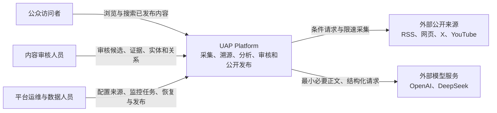
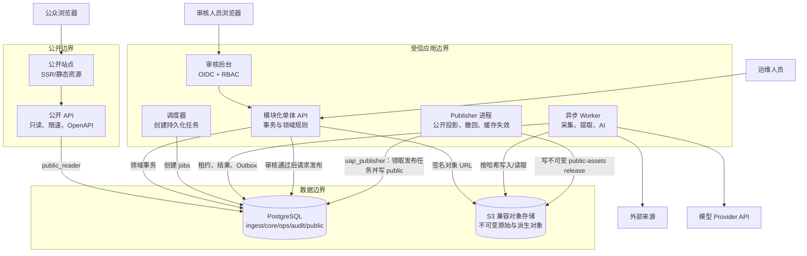
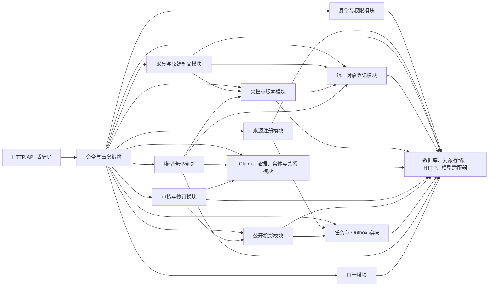
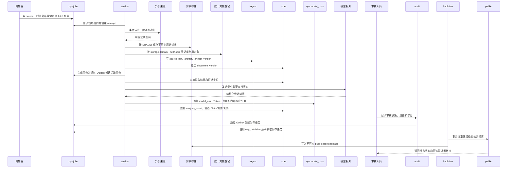

# 目标架构、C4 与数据流

## 1. 系统上下文

系统职责边界：保存来源证据、形成可复核派生结果、执行人工审核并只发布通过的数据。系统不对来源中每项主张自动背书，也不把模型输出视为事实。

## 2. 容器图

容器约束：

- 公开 API 不连接 `ingest`、`core`、`ops` 或 `audit`；其数据库角色只拥有 `public` Schema 的 `SELECT`。
- 审核后台不直接访问数据库或对象存储，所有操作经模块化单体 API 执行并记录审计。
- Worker 不开放公网入站端口；它通过数据库任务租约取工作。
- Publisher 使用独立 `uap_publisher` 凭据，只领取发布/撤回/缓存失效任务；普通 Worker 既不调用 Publisher handler，也没有 `public` 权限。
- 调度器只创建任务，不执行采集或业务写入。
- 第一阶段搜索采用 PostgreSQL 全文索引，达到扩展阈值前不引入独立搜索集群。

## 3. 模块化单体组件图

组件只通过公开应用服务或领域事件协作，不跨模块导入 repository 实现，不直接更新其他模块拥有的表。

## 4. 端到端数据流

## 5. 数据分层与写入权

| 层 | Schema/存储 | 内容 | 唯一写入者 | 公开可见 |
|---|---|---|---|---|
| 原始层 | `ingest` + 对象存储 `raw/` | 来源响应、HTTP 元数据、采集批次、原文件版本 | 采集模块 | 否 |
| 派生层 | `core` + 对象存储 | 统一对象登记、文档版本、提取文本、Claim、证据、实体、关系、AI 多版本结果 | 对象登记/文档/知识/模型模块 | 否 |
| 运行层 | `ops` | jobs、attempts、dead letters、outbox、Prompt、model runs、Token/费用和运行指标 | 任务/模型治理模块 | 否 |
| 审核层 | `audit` | 审核决定、修订、撤回、操作审计 | 审核/审计模块 | 否 |
| 公开层 | `public` | 已通过内容的最小化投影、搜索文档 | 发布模块 | 是，只读 |

## 6. 关键不变量

1. 对象以内容 SHA-256 寻址，`core.stored_objects(storage_domain, content_sha256)` 在同域内唯一；原始版本、提取结果和模型 I/O 只引用该登记，不各自拥有对象 key。
2. 每个文档版本必须指向一个原始 artifact version；提取失败不能替换上一个成功版本。
3. 每条 Claim 证据必须指向具体 `document_version`，并保留字符、页码或时间码定位。
4. 每条 Relation 的两端都是 `core.entities` 外键；禁止多态裸 ID。
5. 每个任务状态变化都必须有 attempt 或系统恢复原因；业务表不承担任务状态。
6. 模型运行和分析结果只追加；选择“当前候选”通过单独的 selection 记录完成。
7. 文档、Claim、实体和关系分别持有与同一 review case/decision/subject 复合绑定的有效授权后才可进入 `public`；`related_entities` 只能来自有授权依据的 `public.document_entities`。
8. 公开投影可全部重建，不作为内部事实的唯一副本。

## 7. 部署与故障边界

- 应用 API、Worker、调度器、Publisher 使用同一代码版本和模块包，但作为四类独立进程部署、使用独立凭据并独立扩缩容。
- PostgreSQL 是事务边界；Outbox 保证“领域写入”和“后续任务/发布事件”不丢失。
- 对象存储故障只阻塞依赖对象的任务，不允许写入缺少对象哈希的成功记录。
- 单一来源、单一模型 Provider 或单个 Worker 故障不应阻断其他来源和公开只读服务。
- Publisher 故障只积压发布任务；公开站点继续提供上一个成功 release，普通 Worker 不接管 Publisher 权限。
- 公开站点和 API 可以在内部采集/AI 暂停时继续提供上一个已发布版本。
