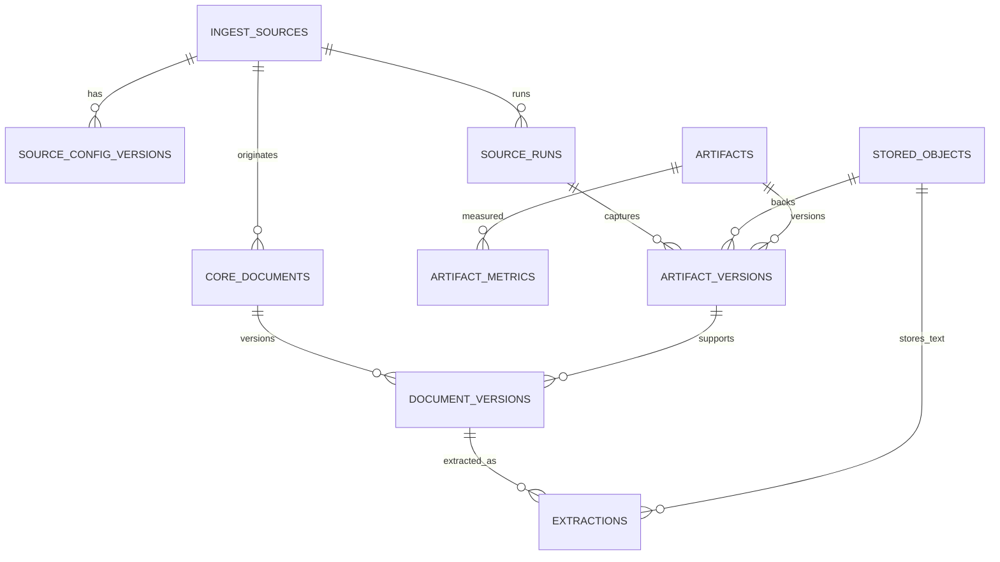
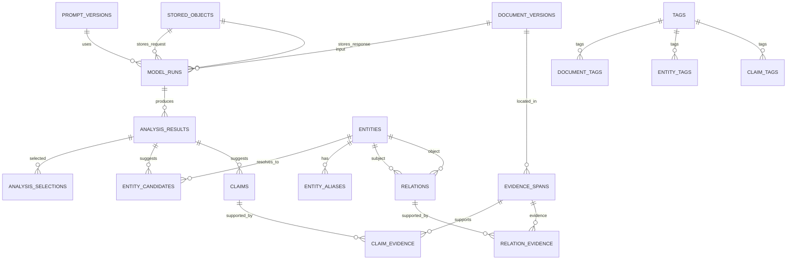
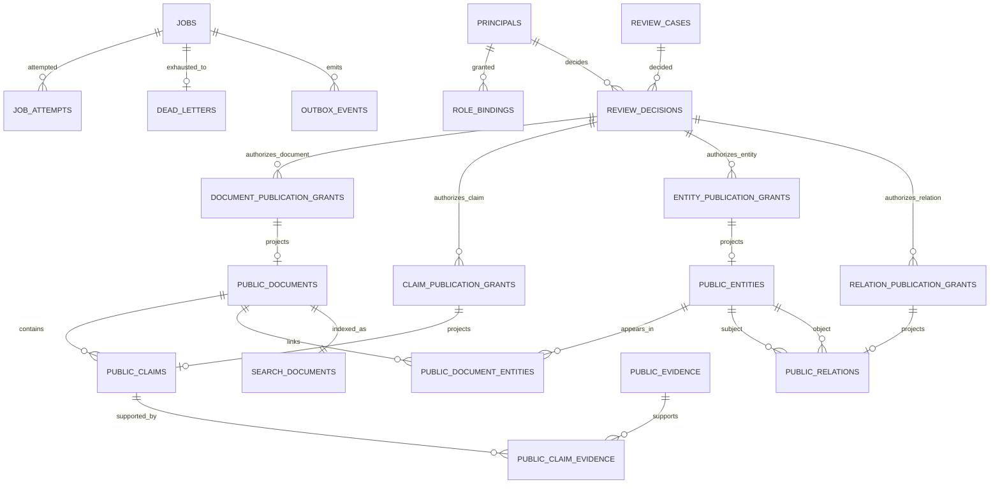

# PostgreSQL 目标 ER 与数据字典

## 1. Schema 约定

| Schema | 数据分类 | 数据库所有者 | 默认保留 |
|---|---|---|---|
| `ingest` | 来源定义、采集运行、原始制品和来源指标 | `collection` | 原始版本长期保留；按合规策略归档 |
| `core` | 文档版本、提取结果、AI 派生结果、Claim、证据、实体、关系、标签 | 对应领域模块 | 版本长期保留；禁止物理覆盖历史 |
| `ops` | 持久化任务、尝试、死信、Outbox、Prompt 和模型调用 | `jobs` / `model_governance` | 热数据 180 天，汇总长期保留 |
| `audit` | 审核、发布授权、撤回、修订和操作审计 | `review` / `audit` | 长期保留，默认禁止删除 |
| `public` | 审核通过后的最小公开投影和搜索文档 | `publishing` | 当前版本在线，历史公开修订可追溯 |

所有目标表使用应用生成的 UUIDv7 主键、`timestamptz` UTC 时间和小写 snake_case 名称。除明确说明外，外键默认 `ON DELETE RESTRICT`；所有 `*_by`、`assigned_to`、`actor_id` 身份字段都外键引用 `audit.principals.id`，时间和身份类审计字段不得由普通业务更新覆盖。

## 2. 原始与文档 ER

### `ingest.sources`

- 所有者：`sources`
- 主键：`id uuid`
- 唯一约束：`slug`；非空 `feed_url` 的规范化值唯一。
- 字段：`slug text`、`name text`、`source_type source_type`、`homepage_url text`、`feed_url text null`、`country_code char(2) null`、`language_code text null`、`enabled boolean`、`created_at timestamptz`、`updated_at timestamptz`。
- 说明：稳定来源身份，不保存 ETag、错误或任务状态。

### `ingest.source_config_versions`

- 所有者：`sources`
- 主键：`id uuid`
- 外键：`source_id -> ingest.sources.id`。
- 唯一约束：`(source_id, version_no)`；每个来源至多一个 `effective_to IS NULL` 的有效版本。
- 字段：`version_no integer`、`configuration jsonb`、`configuration_sha256 char(64)`、`effective_from timestamptz`、`effective_to timestamptz null`、`changed_by uuid`、`change_reason text`。
- 说明：包含关键词、可信度默认值、刷新周期、fallback URL、限速等版本化配置。

### `ingest.source_runs`

- 所有者：`collection`
- 主键：`id uuid`
- 外键：`source_id -> ingest.sources.id`、`job_id -> ops.jobs.id`。
- 唯一约束：`run_key`；`job_id` 唯一。
- 字段：`run_key text`、`outcome source_run_outcome`、`http_status smallint null`、`fetched_count integer`、`parsed_count integer`、`persisted_count integer`、`duplicate_count integer`、`filtered_count integer`、`invalid_count integer`、`etag text null`、`last_modified text null`、`error_code text null`、`error_summary text null`、`started_at`、`finished_at null`。
- 说明：成功、304、空结果和失败都必须有记录；错误摘要经过净化。

### `ingest.artifacts`

- 所有者：`collection`
- 主键：`id uuid`
- 外键：`source_id -> ingest.sources.id`。
- 唯一约束：`(source_id, canonical_locator)`。
- 字段：`canonical_locator text`、`artifact_kind artifact_kind`、`first_seen_at`、`last_seen_at`、`created_at`。
- 说明：表示一个逻辑来源对象，例如网页 URL、RSS 条目、PDF、视频或字幕轨道。

### `core.stored_objects`

- 所有者：`object_registry`
- 主键：`id uuid`
- 唯一约束：`(storage_domain, content_sha256)` 保证同域同哈希只有一个物理对象；`object_key` 全局唯一；另设 `(id, storage_domain)` 和 `(id, storage_domain, content_sha256)` 供复合外键引用。
- 字段：`storage_domain storage_domain`、`bucket_name text`、`object_key text`、`content_sha256 char(64)`、`byte_length bigint`、`media_type text`、`encryption_key_ref text null`、`verified_at timestamptz`、`created_at timestamptz`。
- 说明：这是跨原始、派生和模型 I/O 的统一物理对象登记。业务模块只能通过 object registry 服务“按域和哈希登记或复用”，不能自行拼接对象 key。

### `ingest.artifact_versions`

- 所有者：`collection`
- 主键：`id uuid`
- 外键：`artifact_id -> ingest.artifacts.id`、`source_run_id -> ingest.source_runs.id`；`(stored_object_id, storage_domain) -> core.stored_objects(id, storage_domain)`。
- 唯一约束：`(artifact_id, stored_object_id)`；不同 artifact version 可以共同引用同一 `stored_object_id`。
- 字段：`stored_object_id uuid`、`storage_domain storage_domain DEFAULT 'raw' CHECK (storage_domain='raw')`、`http_status smallint null`、`response_headers jsonb`、`retrieved_at timestamptz`、`source_published_at timestamptz null`、`metadata jsonb`。
- 说明：版本记录不再拥有 `object_key`。原始对象不可变；重复内容复用统一对象登记并只更新 artifact 的 `last_seen_at`。

### `ingest.artifact_metrics`

- 所有者：`collection`
- 主键：`id uuid`
- 外键：`artifact_id -> ingest.artifacts.id`、`source_run_id -> ingest.source_runs.id`。
- 唯一约束：`(artifact_id, captured_at, metric_name)`。
- 字段：`metric_name text`、`metric_value bigint`、`captured_at timestamptz`、`metadata jsonb`。
- 说明：替代专用 `youtube_metrics` 大表耦合，可记录播放、点赞、评论等来源指标。

### `core.documents`

- 所有者：`documents`
- 主键：`id uuid`
- 外键：`source_id -> ingest.sources.id`。
- 唯一约束：`canonical_url` 的非空部分唯一；`(source_id, source_item_key)` 的非空组合唯一。
- 字段：`source_item_key text null`、`canonical_url text null`、`document_kind document_kind`、`first_seen_at`、`last_seen_at`、`created_at`。
- 说明：稳定业务身份，不含提取、AI 或任务状态。

### `core.document_versions`

- 所有者：`documents`
- 主键：`id uuid`
- 外键：`document_id -> core.documents.id`、`artifact_version_id -> ingest.artifact_versions.id`。
- 唯一约束：`(document_id, version_no)`；`(document_id, normalized_content_sha256)`。
- 字段：`version_no integer`、`original_title text null`、`source_published_at timestamptz null`、`language_code text null`、`normalized_content_sha256 char(64)`、`metadata jsonb`、`created_at`。
- 说明：原始页面变化才增加版本；不能被提取失败覆盖。

### `core.extractions`

- 所有者：`documents`
- 主键：`id uuid`
- 外键：`document_version_id -> core.document_versions.id`、`job_attempt_id -> ops.job_attempts.id`、`(text_object_id, storage_domain, output_sha256) -> core.stored_objects(id, storage_domain, content_sha256)`，失败时对象和哈希字段均为空。
- 唯一约束：`(document_version_id, extractor_name, extractor_version, output_sha256)`。
- 字段：`extractor_name text`、`extractor_version text`、`outcome extraction_outcome`、`text_object_id uuid null`、`storage_domain storage_domain DEFAULT 'derived' CHECK (storage_domain='derived')`、`output_sha256 char(64) null`、`title text null`、`author text null`、`language_code text null`、`source_date timestamptz null`、`location_map jsonb`、`error_code text null`、`created_at`。
- 说明：派生正文直接引用统一对象登记，不伪装成 ingest artifact version；`location_map` 保留 PDF 页码、HTML DOM/字符区间和字幕时间码。

## 3. AI、知识与证据 ER

### `ops.prompt_versions`

- 所有者：`model_governance`
- 主键：`id uuid`
- 唯一约束：`(task_type, version)`；`content_sha256`。
- 字段：`task_type model_task_type`、`version text`、`system_template text`、`user_template text`、`output_schema jsonb`、`content_sha256 char(64)`、`active boolean`、`created_by uuid`、`created_at`。

### `ops.model_runs`

- 所有者：`model_governance`
- 主键：`id uuid`
- 外键：`job_attempt_id -> ops.job_attempts.id`、`prompt_version_id -> ops.prompt_versions.id`、`document_version_id -> core.document_versions.id`；`(request_object_id, storage_domain) -> core.stored_objects(id, storage_domain)` 与 response 同理。
- 唯一约束：`idempotency_key`；`(id, document_version_id, task_type)` 供派生结果复合外键引用。
- 字段：`task_type model_task_type`、`provider text`、`model text`、`input_sha256 char(64)`、`request_object_id uuid null`、`response_object_id uuid null`、`storage_domain storage_domain DEFAULT 'model_io' CHECK (storage_domain='model_io')`、`provider_response_id text null`、`status model_run_status`、`input_tokens integer null`、`output_tokens integer null`、`cost_minor_units bigint null`、`currency char(3) null`、`error_code text null`、`started_at`、`finished_at null`。
- 说明：请求/响应对象为内部原始记录，不向公开角色授权；每次调用一行，禁止覆盖。

### `core.analysis_results`

- 所有者：`model_governance`
- 主键：`id uuid`
- 外键：`document_version_id -> core.document_versions.id`；`(model_run_id, document_version_id, result_type) -> ops.model_runs(id, document_version_id, task_type)`。
- 唯一约束：`(model_run_id, result_type)`；`(id, document_version_id, result_type)` 和 `(id, document_version_id)` 供 selections/candidates 复合外键引用。
- 字段：`document_version_id uuid`、`result_type model_task_type`、`schema_version text`、`result jsonb`、`result_sha256 char(64)`、`validation_status validation_status`、`validation_errors jsonb`、`created_at`。
- 说明：结构化派生结果只追加；原始 Provider 响应只在 `model_runs` 对象中。

### `core.analysis_selections`

- 所有者：`model_governance`
- 主键：`id uuid`
- 外键：`document_version_id -> core.document_versions.id`；`(analysis_result_id, document_version_id, result_type) -> core.analysis_results(id, document_version_id, result_type)`。
- 唯一约束：每个 `(document_version_id, result_type)` 至多一条 `superseded_at IS NULL` 的当前选择。
- 字段：`result_type model_task_type`、`selected_by uuid`、`selection_reason text`、`selected_at`、`superseded_at null`。
- 说明：复合外键从数据库层保证被选结果属于同一文档版本和同一任务类型；通过追加选择记录切换当前候选，不 UPDATE/DELETE 历史分析结果。

### `core.entities`

- 所有者：`knowledge`
- 主键：`id uuid`
- 唯一约束：无名称级唯一约束；可选外部标识使用 `(identifier_namespace, identifier_value)` 部分唯一。
- 字段：`entity_type entity_type`、`canonical_name text`、`description text null`、`country_code char(2) null`、`identifier_namespace text null`、`identifier_value text null`、`status entity_status`、`created_at`、`updated_at`。
- 说明：同名人物不自动合并；AI 来源通过 `entity_candidates.resolved_entity_id` 保留，不把单个分析来源错误压入 canonical entity 主记录。

### `core.entity_candidates`

- 所有者：`knowledge`
- 主键：`id uuid`
- 外键：`document_version_id -> core.document_versions.id`；`(analysis_result_id, document_version_id, result_type) -> core.analysis_results(id, document_version_id, result_type)`；`(evidence_span_id, document_version_id) -> core.evidence_spans(id, document_version_id)`，无证据时两字段中的 evidence ID 为空；`resolved_entity_id -> core.entities.id null`。
- 唯一约束：`(analysis_result_id, ordinal)`。
- 字段：`ordinal integer`、`result_type model_task_type`、`proposed_entity_type entity_type`、`proposed_name text`、`proposed_aliases jsonb`、`candidate_payload jsonb`、`status candidate_status`、`resolved_at timestamptz null`、`resolved_by uuid null`、`created_at`。
- 检查：`result_type='entity_extraction'`；resolved 状态必须具有 `resolved_entity_id/resolved_by/resolved_at`。
- 说明：每次 AI 实体候选都保留具体 analysis result 和文档版本；多次候选可以解析为同一 canonical entity，合并仍可撤销。

### `core.entity_aliases`

- 所有者：`knowledge`
- 主键：`id uuid`
- 外键：`entity_id -> core.entities.id`、`source_document_version_id -> core.document_versions.id null`。
- 唯一约束：`(entity_id, normalized_alias, locale)`。
- 字段：`alias text`、`normalized_alias text`、`locale text`、`source_document_version_id uuid null`、`created_at`。

### `core.entity_merge_events`

- 所有者：`knowledge`
- 主键：`id uuid`
- 外键：`source_entity_id -> core.entities.id`、`target_entity_id -> core.entities.id`、`reversed_by_id -> core.entity_merge_events.id null`。
- 唯一约束：一条 merge event 至多被一个 reversal 引用。
- 字段：`reason text`、`merged_by uuid`、`merged_at`、`reversed_by_id uuid null`、`reversed_at null`。
- 说明：合并通过可撤销事件表达，不删除来源实体或证据。

### `core.claims`

- 所有者：`knowledge`
- 主键：`id uuid`
- 外键：`origin_analysis_result_id -> core.analysis_results.id null`、`subject_entity_id -> core.entities.id null`。
- 唯一约束：AI 结果内 `(origin_analysis_result_id, ordinal)`；不跨结果强制合并相似 Claim。
- 字段：`ordinal integer null`、`claim_text text`、`claim_fingerprint char(64)`、`claim_type claim_type`、`assertion_status assertion_status`、`attribution text null`、`created_by uuid null`、`created_at`。
- 说明：`assertion_status` 描述主张评价，不继承来源可信度。

### `core.evidence_spans`

- 所有者：`knowledge`
- 主键：`id uuid`
- 外键：`document_version_id -> core.document_versions.id`、`extraction_id -> core.extractions.id null`。
- 唯一约束：`(document_version_id, locator_sha256)`；`(id, document_version_id)` 供候选来源复合外键引用。
- 字段：`evidence_text text`、`locator_type locator_type`、`char_start integer null`、`char_end integer null`、`page_start integer null`、`page_end integer null`、`time_start_ms bigint null`、`time_end_ms bigint null`、`locator jsonb`、`locator_sha256 char(64)`、`created_at`。
- 检查：定位字段必须与 `locator_type` 一致；区间结束不得小于开始。

### `core.claim_evidence`

- 所有者：`knowledge`
- 主键：`id uuid`。
- 外键：`claim_id -> core.claims.id`、`evidence_span_id -> core.evidence_spans.id`。
- 唯一约束：`(claim_id, evidence_span_id)`。
- 字段：`support_type support_type`、`created_at`。
- 说明：发布门禁要求每个公开候选 Claim 至少存在一条 `support_type='supports'` 的证据关联。

### `core.relations`

- 所有者：`knowledge`
- 主键：`id uuid`
- 外键：`subject_entity_id -> core.entities.id`、`object_entity_id -> core.entities.id`、`origin_analysis_result_id -> core.analysis_results.id null`。
- 唯一约束：`(subject_entity_id, predicate, object_entity_id, origin_analysis_result_id)`。
- 字段：`predicate text`、`relation_status relation_status`、`confidence numeric(4,3) null`、`created_by uuid null`、`created_at`。
- 检查：两端不得相同（允许自反关系时需在 predicate 词典显式放行）；置信度 0 至 1。

### `core.relation_evidence`

- 所有者：`knowledge`
- 主键：`id uuid`
- 外键：`relation_id -> core.relations.id`、`evidence_span_id -> core.evidence_spans.id`。
- 唯一约束：`(relation_id, evidence_span_id)`。
- 说明：所有关系证据都先成为可定位 evidence span，不保存孤立文本。

### `core.tags`

- 所有者：`knowledge`
- 主键：`id uuid`
- 外键：`parent_id -> core.tags.id null`。
- 唯一约束：`slug`。
- 字段：`name text`、`slug text`、`tag_type tag_type`、`description text null`、`created_at`、`updated_at`。

### `core.document_tags`、`core.entity_tags`、`core.claim_tags`

- 所有者：`knowledge`
- 主键：各自 `id uuid`。
- 外键：分别连接 `tags` 与 `document_versions`、`entities`、`claims` 的真实外键；三表的 `origin_analysis_result_id -> core.analysis_results.id null`。
- 唯一约束：对应两端 ID 组合唯一。
- 公共字段：`method assignment_method`、`confidence numeric(4,3) null`、`origin_analysis_result_id uuid null`、`created_at`。
- 说明：用三个关联表替代无法由数据库约束的多态 `tag_assignments(entity_type, entity_id)`。

## 4. 任务、审核与公开 ER

### `ops.jobs`

- 所有者：`jobs`
- 主键：`id uuid`
- 唯一约束：有效任务上的 `idempotency_key`；具体部分唯一索引在 WP4 冻结。
- 字段：`job_type text`、`payload jsonb`、`payload_schema_version text`、`idempotency_key text`、`status job_status`、`priority smallint`、`available_at timestamptz`、`lease_owner text null`、`lease_expires_at null`、`attempt_count integer`、`max_attempts integer`、`timeout_seconds integer`、`created_at`、`completed_at null`。

### `ops.job_attempts`

- 所有者：`jobs`
- 主键：`id uuid`
- 外键：`job_id -> ops.jobs.id`。
- 唯一约束：`(job_id, attempt_no)`。
- 字段：`attempt_no integer`、`worker_id text`、`started_at`、`finished_at null`、`duration_ms bigint null`、`outcome attempt_outcome`、`http_status smallint null`、`error_class text null`、`error_code text null`、`error_summary text null`、`retry_at null`、`metrics jsonb`。

### `ops.dead_letters`

- 所有者：`jobs`
- 主键：`id uuid`
- 外键：`job_id -> ops.jobs.id`、`last_attempt_id -> ops.job_attempts.id`。
- 唯一约束：`job_id`。
- 字段：`reason_code text`、`payload_snapshot jsonb`、`dead_at`、`resolved_at null`、`resolution text null`。

### `ops.outbox_events`

- 所有者：`jobs`
- 主键：`id uuid`
- 外键：`causation_job_id -> ops.jobs.id null`。
- 唯一约束：`event_key`。
- 字段：`aggregate_type text`、`aggregate_id uuid`、`event_type text`、`event_key text`、`payload jsonb`、`occurred_at`、`published_at null`、`publish_attempts integer`、`last_error_code text null`。

### `audit.principals`

- 所有者：`identity`
- 主键：`id uuid`
- 唯一约束：人员主体 `(issuer, subject)`；服务主体 `service_name` 的非空值唯一。
- 字段：`principal_type principal_type`、`issuer text null`、`subject text null`、`service_name text null`、`display_name text`、`active boolean`、`created_at`、`last_seen_at null`。
- 说明：只保存 OIDC 稳定主体标识和服务账号映射，不保存密码或 Token。

### `audit.role_bindings`

- 所有者：`identity`
- 主键：`id uuid`
- 外键：`principal_id -> audit.principals.id`、`granted_by -> audit.principals.id`、`revoked_by -> audit.principals.id null`。
- 唯一约束：每个 `(principal_id, role, scope_type, scope_id)` 至多一条 `revoked_at IS NULL` 的有效绑定。
- 字段：`role application_role`、`scope_type text`、`scope_id uuid null`、`reason text`、`granted_at`、`revoked_at null`。

### `audit.review_cases`

- 所有者：`review`
- 主键：`id uuid`
- 外键：可选的 `document_version_id`、`claim_id`、`entity_id`、`relation_id` 分别指向真实目标表。
- 检查：四个 subject 外键必须且只能有一个非空。
- 唯一约束：同一 subject 至多一个未关闭 case；另设 `(id, document_version_id)`、`(id, claim_id)`、`(id, entity_id)`、`(id, relation_id)` 唯一组合供各授权表复合外键引用。
- 字段：`case_type review_case_type`、`status review_status`、`priority smallint`、`assigned_to uuid null`、`opened_by uuid`、`opened_at`、`closed_at null`。

### `audit.review_decisions`

- 所有者：`review`
- 主键：`id uuid`
- 外键：`review_case_id -> audit.review_cases.id`。
- 唯一约束：`(review_case_id, sequence_no)`；`(id, review_case_id)` 供授权表复合外键引用。
- 外键：`decided_by -> audit.principals.id`、`supersedes_decision_id -> audit.review_decisions.id null`。
- 字段：`sequence_no integer`、`decision review_decision`、`reason text`、`structured_changes jsonb`、`decided_at`。
- 说明：候选、通过、驳回、争议、撤回和修订都追加记录。

### `audit.document_publication_grants`、`audit.claim_publication_grants`、`audit.entity_publication_grants`、`audit.relation_publication_grants`

- 所有者：`review`
- 主键：各表 `id uuid`
- 外键：四表分别引用 `document_version_id`、`claim_id`、`entity_id`、`relation_id`；均含 `review_case_id`、`decision_id`、`withdrawn_by_decision_id null`。
- 唯一约束：每个 subject 至多一个 `withdrawn_at IS NULL` 的有效授权；`decision_id` 在对应授权表唯一。
- 复合约束：`(review_case_id, subject_id)` 外键引用 `review_cases` 对应的真实 subject 组合；`(decision_id, review_case_id)` 和 `(withdrawn_by_decision_id, review_case_id)` 分别外键引用 `review_decisions(id, review_case_id)`，确保授权及撤回决定都属于审核该 subject 的同一 case。约束触发器要求授权决定为 `approve/revise`，撤回决定为 `withdraw`。
- 字段：`review_case_id uuid`、对应 `subject_id uuid`、`decision_id uuid`、`revision_no integer`、`grant_status grant_status`、`granted_at`、`withdrawn_by_decision_id uuid null`、`withdrawn_at null`、`publication_payload_sha256 char(64)`。
- 说明：拆为四张真实外键表，避免无法由数据库证明目标类型的多态授权。

### `audit.audit_events`

- 所有者：`audit`
- 主键：`id uuid`
- 唯一约束：`event_key`。
- 外键：`actor_id -> audit.principals.id`。
- 字段：`event_key text`、`action text`、`target_type text`、`target_id uuid null`、`request_id uuid null`、`before_digest char(64) null`、`after_digest char(64) null`、`metadata jsonb`、`occurred_at`。
- 权限：只允许 INSERT 和受控 SELECT；普通应用角色无 UPDATE/DELETE。

### `public.documents`

- 所有者：`publishing`
- 主键：`id uuid`，与内部 ID 分离的稳定公开 ID。
- 外键：`document_grant_id -> audit.document_publication_grants.id`。
- 唯一约束：`slug`、`canonical_source_url`、`document_grant_id`。
- 字段：`slug text`、`title text`、`summary text null`、`category text`、`fact_status text`、`source_name text`、`canonical_source_url text`、`source_published_at timestamptz null`、`published_at`、`revised_at null`、`revision_no integer`。
- 禁止字段：原始正文、提取全文、对象 key、内部文档 ID、Prompt、模型响应、错误、审核员 ID。

### `public.claims`

- 所有者：`publishing`
- 主键：`id uuid`。
- 外键：`document_id -> public.documents.id`、`claim_grant_id -> audit.claim_publication_grants.id`。
- 唯一约束：`(document_id, ordinal, revision_no)`；`claim_grant_id` 唯一。
- 字段：`ordinal integer`、`claim_text text`、`claim_type text`、`assertion_status text`、`attribution text null`、`revision_no integer`。

### `public.evidence`

- 所有者：`publishing`
- 主键：`id uuid`。
- 外键：`document_id -> public.documents.id`。
- 唯一约束：`(document_id, locator_sha256)`；`(id, document_id)` 供公开关联复合外键引用。
- 字段：`excerpt text`、`locator_type text`、`page_start/page_end integer null`、`time_start_ms/time_end_ms bigint null`、`public_locator jsonb`、`locator_sha256 char(64)`、`source_url text`。
- 说明：只公开经审核的最小证据摘录和可理解定位，不公开完整内部正文。

### `public.claim_evidence`

- 所有者：`publishing`
- 主键：`id uuid`。
- 外键：`claim_id -> public.claims.id`、`evidence_id -> public.evidence.id`。
- 唯一约束：`(claim_id, evidence_id)`。
- 说明：发布事务在写 Claim 时必须同时写入至少一项证据，否则整个公开投影事务失败。

### `public.entities`

- 所有者：`publishing`
- 主键：`id uuid`。
- 外键：`entity_grant_id -> audit.entity_publication_grants.id`。
- 唯一约束：`slug`、`entity_grant_id`；不对名称强制唯一。
- 字段：`slug text`、`entity_type text`、`name text`、`description text null`、`country_code char(2) null`、`published_at`、`revision_no integer`。

### `public.relations`

- 所有者：`publishing`
- 主键：`id uuid`。
- 外键：`subject_entity_id -> public.entities.id`、`object_entity_id -> public.entities.id`、`relation_grant_id -> audit.relation_publication_grants.id`。
- 唯一约束：`(subject_entity_id, predicate, object_entity_id, revision_no)`；`relation_grant_id` 唯一，单个授权只能生成一个当前公开关系投影。
- 字段：`predicate text`、`relation_status text`、`published_at`、`revision_no integer`。

### `public.relation_evidence`

- 所有者：`publishing`
- 主键：`id uuid`。
- 外键：`relation_id -> public.relations.id`、`evidence_id -> public.evidence.id`。
- 唯一约束：`(relation_id, evidence_id)`。

### `public.document_entities`

- 所有者：`publishing`
- 主键：`id uuid`。
- 外键：`document_id -> public.documents.id`、`entity_id -> public.entities.id`；`(basis_evidence_id, document_id) -> public.evidence(id, document_id)`；可选 `basis_claim_id -> public.claims.id`、`basis_relation_id -> public.relations.id`。
- 唯一约束：`(document_id, entity_id)`。
- 检查：`basis_claim_id` 与 `basis_relation_id` 至少一个非空；若两者都有值，必须属于同一次发布 revision。复合外键从数据库层保证 `basis_evidence_id` 属于同一公开文档。
- 说明：这是 `DocumentDetail.related_entities` 的明确数据库来源；实体、文档和同文档证据依据都已通过对应授权投影。

### `public.search_documents`

- 所有者：`publishing`
- 主键：`document_id uuid`。
- 外键：`document_id -> public.documents.id ON DELETE CASCADE`。
- 唯一约束：主键即唯一。
- 字段：`search_vector tsvector`、`display_text text`、`facets jsonb`、`indexed_at`。
- 索引：`GIN(search_vector)` 和批准的 facet 索引。

## 5. 现有模型迁移映射

| 当前 SQLite | 目标位置 | 设计变化 |
|---|---|---|
| `sources` 配置字段 | `ingest.sources` + `source_config_versions` | 稳定身份与版本配置分离 |
| `sources` 抓取状态 | `source_runs` + `ops.jobs` | 不再覆盖来源主记录 |
| `news.raw_content` | `artifact_versions` 对象 | 原始内容不可变并按哈希寻址 |
| `news` 来源条目 | `core.documents` + `document_versions` | 业务身份与内容版本分离 |
| extraction/translation/analysis 状态列 | `ops.jobs` + `job_attempts` | 从业务主表移除任务状态 |
| `news.extracted_content` | `core.extractions` + derived 对象 | 追加提取版本，保留定位 |
| `news.analysis_json` 等 | `model_runs` + `analysis_results` + selections | AI 多版本追加，不覆盖 |
| `relationships` 多态 ID | `core.relations` | 两端统一实体真实外键 |
| `tag_assignments` 多态 ID | 三个明确关联表 | 数据库可强制外键 |
| `person_relationship_evidence.evidence_text` | `evidence_spans` + `relation_evidence` | 证据必须定位文档版本 |
| 发布 Markdown | `public` 投影后生成站点/API | 仅审核通过内容可见 |

## 6. 枚举与约束策略

- 稳定、跨模块状态使用 PostgreSQL enum 或受控字典表；易扩展的业务词汇使用字典表，不用任意文本。
- `job_status` 至少包含 `queued/leased/running/succeeded/retry_wait/dead/cancelled`。
- `review_decision` 至少包含 `approve/reject/dispute/withdraw/revise`。
- 所有 JSONB 字段都有 Pydantic/JSON Schema 版本，关键可查询字段不得只藏在 JSONB。
- SHA-256 使用 64 位小写十六进制并加格式 CHECK；URL 在应用层规范化后入库。
- 敏感对象 key、内部错误和 Provider 响应不得进入 `public` Schema。

## 7. 数据所有权与删除规则

- 原始 artifact version、model run、analysis result、review decision、audit event 只追加，不做业务级硬删除。
- 来源停用使用 `enabled=false`；实体合并使用 merge/reversal event；公开撤回删除或失效公开投影但保留内部授权历史。
- PostgreSQL 备份覆盖五个 Schema；对象存储清单和数据库 artifact 元数据必须同时进入恢复演练。
- 物理清理只能由独立保留策略任务执行，并要求审计事件、法律/业务批准和可验证清单。
