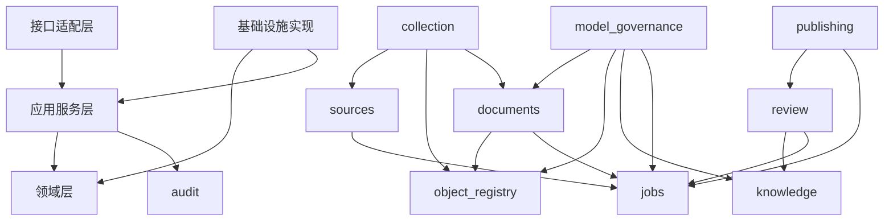

# 模块职责与依赖规则

## 模块清单

| 模块 | 拥有的数据 | 对外能力 | 禁止事项 |
|---|---|---|---|
| `identity` | 用户映射、角色绑定；认证主体来自 OIDC | 鉴权、授权、服务主体解析 | 不保存密码；不绕过 audit |
| `sources` | `ingest.sources`、来源配置版本 | 来源启停、配置读取、调度提示 | 不直接发起 HTTP；不保存运行任务状态 |
| `collection` | `ingest.source_runs`、artifacts/versions | fetch/parse/normalize/persist 契约 | 不写 Claim、公开表或 AI 结果 |
| `object_registry` | `core.stored_objects` | 按域与哈希登记/复用对象、校验大小与哈希 | 不解释业务内容；不允许调用方自定 object key |
| `documents` | `core.documents`、`document_versions`、extractions | 版本追加、内容哈希、定位映射 | 不覆盖成功版本；不承担队列状态 |
| `model_governance` | `ops.model_runs`、`analysis_results`、selections | Prompt 版本、Provider 调用、结果校验 | 不直接发布；不覆盖历史运行 |
| `knowledge` | entities、aliases、claims、evidence、relations | 实体合并/撤销、证据绑定、关系约束 | 不自动把来源可信度变成 Claim 真实性 |
| `review` | review cases、decisions、revisions、withdrawals | 候选审核、修订、撤回 | 不修改原始 artifact；不跳过审计 |
| `publishing` | `public` 全部投影、发布版本 | 发布/撤回投影、缓存失效事件 | 不读取模型原始响应；不接受未审核候选 |
| `jobs` | jobs、attempts、dead letters、outbox | 幂等入队、租约、重试、恢复 | 不把状态回写到业务主表 |
| `audit` | audit events | 追加操作审计、查询审计 | 不允许 UPDATE/DELETE 审计事实 |

## 依赖方向



## 强制规则

1. 领域层不得导入 FastAPI、SQLAlchemy Session、S3 SDK、HTTP 客户端或模型 SDK。
2. 模块只能通过应用服务接口、稳定 DTO 或 Outbox 领域事件互相调用。
3. repository 只能访问本模块拥有的表；跨模块查询使用只读 query service。
4. 单个业务事务可以由应用服务协调多个模块 repository，但必须在同一数据库事务中，并由 Outbox 提交后续异步动作。
5. Worker handler 只能调用采集、文档、模型和知识应用服务，不能包含裸 SQL、跨表状态机或 publishing handler。
6. `public` 投影只能由独立 Publisher 进程以 `uap_publisher` 凭据调用 publishing 模块写入；API、Worker、Scheduler 和其他模块对 `public` 无写权限。
7. OpenAPI DTO 与数据库行模型分离；禁止 `SELECT *` 后直接序列化返回。
8. 对象存储 key 只能由 object registry 服务生成，业务模块不拼接任意路径。

## 目标代码布局

```text
src/uap_platform/
├── api/                    # public/admin HTTP adapters and DTOs
├── application/            # transaction-oriented use cases
├── domains/
│   ├── identity/
│   ├── sources/
│   ├── collection/
│   ├── object_registry/
│   ├── documents/
│   ├── model_governance/
│   ├── knowledge/
│   ├── review/
│   ├── publishing/
│   ├── jobs/
│   └── audit/
├── infrastructure/         # PostgreSQL, S3, HTTP and provider adapters
├── worker/                 # collection/extraction/model/knowledge handlers
├── publisher/              # publishing-only handlers and Publisher process
└── scheduler/              # schedule evaluation and enqueue process
alembic/
├── env.py
└── versions/               # 唯一可部署迁移链
```

不得再建立 `src/.../migrations` 副本。打包和部署直接包含项目根目录的 Alembic 目录或专用迁移镜像。

## 同步与异步边界

- 同步：鉴权、来源配置修改、审核决策、查询、创建发布请求。
- 普通 Worker 异步：采集、原始对象保存、正文提取、AI 和实体候选。
- Publisher 异步：公开投影重建、撤回、public-assets release 和缓存失效。
- 同步接口只返回已提交的业务状态和任务 ID，不等待外部来源或模型 Provider。
- 异步链路通过幂等键和 Outbox 串联，不依赖进程内消息或内存队列。
